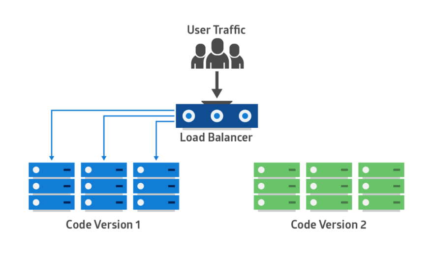
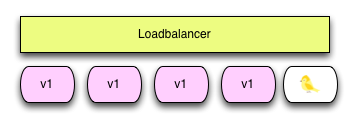
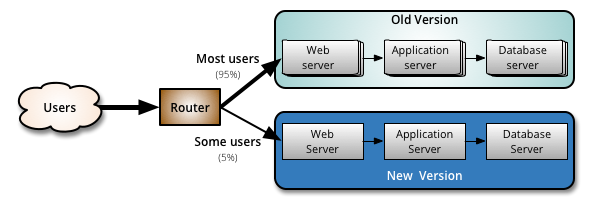

# 生产环境各高级发布策略的概念及差异化
日期:2019-11-21

**整理作者列表(字母顺序)：刘发鹏 李正南 薛凯铭 谢正华 徐浪 周忠**

[Toc]


## 前言
&ensp;&ensp;&ensp;&ensp;&ensp;&ensp;&ensp;作为技术人员，大家可能听说过“滚动发布”和“蓝绿发布”等术语，但是很多人并不清楚这些术语背后的原理。其实这些术语均是指在生产环境中的发布的一种策略，本文试图总结当前主流的发布策略，每个的优劣，适用性，让开发人员特别是架构师对现代发布技术有一个更为清晰全面的认识，让大家能够根据自己的企业上下文，对发布策略做出正确的选型和实践。<br>
&ensp;&ensp;&ensp;&ensp;&ensp;&ensp;&ensp;发布策略从服务器组的概念可分为单组服务器和双组服务器，这两种分法对于所采用的发布方式也是不同，可分为下面两大类。

### 单组服务器
1. 暴力发布
2. 金丝雀发布
3. 滚动式发布

### 双组服务器
1. 蓝绿发布
2. 灰度发布
	- A/B测试，面向用户体验，支持决策
	- 金丝雀发布
3. 滚动发布 

### 其他方式

1. 功能开关发布
2. 影子测试


第一章 单组服务器发布方式的介绍
-----
&ensp;&ensp;&ensp;&ensp;&ensp;&ensp;&ensp;先解释下单服务器组的概念，早先我们机器资源比较紧张，不像现在云计算和虚拟化（包括容器技术）如此发达，所以应用机器基本是预先静态分配好的（一般由运维负责分配），原来应用A部署在这N台机器上，那么下次升级发布的应用A也住在这N台机器上，所以称为单服务器组发布方式。一般的在生产环境中这里的N取值范围是，1&le;N&le;20。在单组服务发布的策略中，一般不考虑数据库层的问题，但在双组服务器需要考虑数据库的问题。

## 1. 暴力发布策略

### 1.1 概念
&ensp;&ensp;&ensp;&ensp;&ensp;&ensp;&ensp;暴力发布策略是不考虑服务的状态，直接部署并且重启。这种发布方式比较简单粗暴，有点像我们传统的软件升级方式，主要靠手工完成，先将老版本V1全部下掉，再将新版本发到机器上去。这种方式会引入服务中断（停机），在开发测试环境是可行的，但对于生产环境发布，其会直接影响用户的使用体验，一般是不建议。

### 1.2 原理
&ensp;&ensp;&ensp;&ensp;&ensp;&ensp;&ensp;采用手工替换服务的方式，一次性下线全部的服务，然后再全部更新的版本至服务组中。 如下图。
#### 1.2.1 发布前

#### 1.2.2 发布后

#### 1.2.3 流量模式
根据上述的发布策略，暴力的发布流量图如下，可以发现，在发布过程中有一个明显的宕机时间。

### 1.3 流程
1. 先停止所有v1版本的服务
2. 部署所有v2版本的服务
3. 测试验证是否有问题

### 1.4 适用场景 
- 开发测试环境
- 非关键应用（用户影响面小）
- 初创公司什么都缺，找夜深人静用户访问量小的时间部署。

### 1.5 技术要点
&ensp;&ensp;&ensp;&ensp;&ensp;&ensp;&ensp;对于暴力发布的策方案，本身无技术难点可言，但为了提升效率，可以采用手工方式、脚本方式，Jenkins、或是ansible类的工具执行。所以需要掌握的技术有

1. shell脚本 
2. Jenkins
3. ansible管理工具

### 1.6 优劣势
优势：

- 简单成本低

不足：

- 服务中断用户受影响
- 回滚时间长

## 2. 单组服务器金丝雀发布策略

### 2.1 概念
&ensp;&ensp;&ensp;&ensp;&ensp;&ensp;&ensp;在暴力发布基础上的一种简单改进发布方式，是按节点比例发布方式，单节点全流量全部受影响。目前仍然是不少成长型技术组织的主流发布方式。
### 2.2 原理

&ensp;&ensp;&ensp;&ensp;&ensp;&ensp;&ensp;金丝雀发布一般先发1 台，或者一个小比例，例如 2% 的服务器，主要做流量验证用，也称为金丝雀 (Canary) 测试（国内常称灰度测试，实际是属于灰度的一种）。

**金丝雀发布策略由来**
> 矿井中的金丝雀：17 世纪，英国矿井工人发现，金丝雀对瓦斯这种气体十分敏感。空气中哪怕有极其微量的瓦斯，金丝雀也会停止歌唱；当瓦斯含量超过一定限度时，虽然鲁钝的人类毫无察觉，金丝雀却早已毒发身亡。当时在采矿设备相对简陋的条件下，工人们每次下井都会带上一只金丝雀作为瓦斯检测指标，以便在危险状况下紧急撤离。

&ensp;&ensp;&ensp;&ensp;&ensp;&ensp;&ensp;根据上述故事，先会放一只金丝雀进去探是否有有毒气体，看金丝雀能否活下来，金丝雀发布由此得名。简单的金丝雀测试一般通过手工测试验证，复杂的金丝雀测试需要比较完善的监控基础设施配合，通过监控指标反馈，观察金丝雀的健康状况，作为后续发布或回退的依据。

&ensp;&ensp;&ensp;&ensp;&ensp;&ensp;&ensp;单服务器组下的金丝雀发布策略的简化原理如下图。
#### 2.2.1 发布前


#### 2.2.2 发布中


#### 2.2.3 发布后

#### 2.2.4 流量模式
少量金丝雀节点先接受流量，再全量发布<br>


### 2.3 流程

1. 先从LB摘取一台服务，或是更改LB的权重，使得其中一台为0。
2. 摘除后的节点更新V2版本，打开流量开关，使得流量进入到V2版本。（该流量可以为节点数据的1/N，也可以在LB上自定义百分比。）
3. 监测V2版本上的流量和业务是否正常，决定其他节点是否更新到V2版本上。
4. 如果一切正常，再逐步发布到所有节点上。 

### 2.4 适用场景 
- 对新版本功能或性能缺乏足够信心
- 用户体验要求较高的网站业务场景
- 缺乏足够的自动化发布工具研发能力

### 2.5 技术要点
发布过程中可以考虑自动化工具，主要涉及到的技术有

1. LB负载技术，一般有Nginx、haproxy，F5，或自研的gateway API等
2. 远程操作工具，ansible、或jenkins工具。

### 2.6. 优劣势
优势：

- 用户体验影响小，金丝雀发布过程出现问题只影响少量用户

不足：

- 发布自动化程度不够，发布期间可引发服务中断


## 3. 滚动发布策略

### 3.1 概念
&ensp;&ensp;&ensp;&ensp;&ensp;&ensp;&ensp;滚动、阶段性的发布，阶段性时间体现一般在分钟级别内，因为它们可以最大限度的降低相关风险，包括面向用户的停机时间。当然这个也是在金丝雀发布基础上的进一步优化改进，是一种自动化程度较高的发布方式，用户体验比较平滑，是目前成熟型技术组织所采用的主流发布方式。
### 3.2 原理
&ensp;&ensp;&ensp;&ensp;&ensp;&ensp;&ensp;在滚动部署中，应用的新版本逐步替换旧版本。实际的部署发生在一段时间内。一段时间的大小一般在30分钟内，在此期间，新旧版本会共存，而不会影响功能和用户体验。这个过程可以更轻易的回滚和旧组件不兼容的任何新组件。

&ensp;&ensp;&ensp;&ensp;&ensp;&ensp;&ensp;下图显示了该部署模式：旧版本显示为蓝色，新版本显示为绿色，它们部署在集群中的每一台服务器上。


&ensp;&ensp;&ensp;&ensp;&ensp;&ensp;&ensp;应用程序套件升级是一个滚动部署的典型例子。如果原始应用部署在容器中，升级可以一次处理一个容器。修改每个容器从应用供应商的站点上下载最新的镜像。如果其中的一个应用存在兼容性问题，旧的镜像可以重新创建这个容器。在这种情况下，套件的新旧版本应用可以共存，直到每个应用都更新完毕。

&ensp;&ensp;&ensp;&ensp;&ensp;&ensp;&ensp;我们再从另外一个角度发布看看滚动发布的原理。

#### 3.2.1 发布前


#### 3.2.2 发布中

#### 3.2.1 继续发布中

#### 3.2.1 发布后

#### 3.2.1 流量模式
滚动式发布，流量平滑过渡<br>


### 3.3 流程
&ensp;&ensp;&ensp;&ensp;&ensp;&ensp;&ensp;滚动式发布国外术语通常叫 Rolling Update Deployment。

1. 滚动式发布一般先发1台，或者一个小比例，如2%服务器，主要做流量验证用，类似金丝雀(Canary)测试。
2. 滚动式发布需要比较复杂的发布工具和智能LB支持平滑的版本替换和流量拉入拉出。
3. 每次发布时，先将老版本V1流量从LB上摘除，然后清除老版本，发新版本V2，再将LB流量接入新版本。这样可以尽量保证用户体验不受影响。
4. 一次滚动式发布一般由若干个发布批次组成，每批的数量一般是可以配置的（可以通过发布模板定义）。例如第一批1台（金丝雀），第二批10%，第三批50%，第四批100%。每个批次之间留观察间隔，通过手工验证或监控反馈确保没有问题再发下一批次，所以总体上滚动式发布过程是比较缓慢的 (其中金丝雀的时间一般会比后续批次更长，比如金丝雀10分钟，后续间隔2分钟)。
5. 回退是发布的逆过程，将新版本流量从LB上摘除，清除新版本，发老版本，再将LB流量接入老版本。和发布过程一样，回退过程一般也比较慢的。

### 3.4 适用场景 
- 用户体验不能中断的网站业务场景
- 有一定的复杂发布工具研发能力；
### 3.5 技术要点
&ensp;&ensp;&ensp;&ensp;&ensp;&ensp;&ensp;根据滚动发布的特点，我们不难看出几个关键技术要点，首先是在LB技术上，LB可以随时接入或删除新节点，其次在滚动发布之间需要检测新节点的正确性，然后需要自动化的工具和平台支持，最后还要考虑发布异常的可逆过程，即回滚操作，需要实现自动，总结如下。

1. LB技术的掌握，软件级别的如Nginx、haproxy等，平台级别的如kubernets的ingress,或proxy、微服务里注册中心eureka等技术类。
2. 已经发布的服务需要检查，需要服务本身提供可检查的接口或状态接口，可以使用脚本或平台的工具实现4层或7层的检查，以便判断新的进程启动后是否正常。
3. 在整个发布过程中需要自动化工具，如kubernetes的编排引擎，或自我实现的脚本等。回滚操作也是如此。需要对自动化控制这块有较好的技术积累。

**注：虽然上述技术可以解决宕机的问题，但在微服务架构中，自动化工具务必要与服务注册配合使用，否则依旧会出现个别请求错误问题或后端503，如下过程**

```
1. 先启动1个新实例，LB上自动对接
2. 摘除1个老实例，如果此不判断老实例的连接是否完全处理完，正在处理的请求会直接被中断，这个连接的事务将失败。

正确的流程是：
1. 先启动一个新实例，LB接收到新实例的状态，已经正常。
2. LB给注册中心eureka发一个请求，“现在启动一个新实例，需要你摘除一个老实例，等待你回复”
3. 注册中心eureka收到后，选择了一个连接最少的实例，告诉LB，“我选中了连接最少的A，容器ID是A12345,等该实例处理完所有请求后，通知你”
4. LB回复收到后，等待注册中心eureka的回复
5. LB收到注册中心eureka的回复“A12345己无连接，我已经从注册中心中踢出去了，不会有新的连接分配到它上面了，现在你可以删除实例A12345”
6. LB回复注册中心eureka，“收到，我下线A12345,再见”
7. LB下线A12345

上面的过程循环往复执行，直到所有实例全部替换成新版本V2即可。
```

### 3.6. 优劣势
优势：

- 用户体验影响小，体验较平滑

不足：

- 发布和回退时间比较缓慢
- 发布工具比较复杂，LB 需要平滑的流量摘除和拉入能力


第二章 双组服务器发布策略的介绍
-----
&ensp;&ensp;&ensp;&ensp;&ensp;&ensp;&ensp;本章重点介绍在双组服务器的生产环境中的发布策略，包括了蓝绿发布、灰度发布、双组服务器滚动发布。其中灰度发布包括金丝雀发布和A/B测试。
## 1. 蓝绿发布策略

### 1.1 概念
&ensp;&ensp;&ensp;&ensp;&ensp;&ensp;&ensp;蓝绿部署是最常见的一种不需要停机的部署方式，是一种以可预测的方式发布应用的技术，目的是减少发布过程中服务停止的时间。<br>
&ensp;&ensp;&ensp;&ensp;&ensp;&ensp;&ensp;在发布的过程中用户无感知服务的重启，通常情况下是通过新旧版本并存的方式实现，也就是说在发布的流程中，新的版本和旧的版本是相互热备的，通过切换路由权重的方式（非0即100）实现不同的应用的上线或者下线，如下示意图


&ensp;&ensp;&ensp;&ensp;&ensp;&ensp;&ensp;蓝绿发布是一种零宕机的应用更新策略。进行蓝绿发布时，应用的旧版本服务与新版本服务会同时并存，同一个应用不同版本的服务之间共享路由，通过调节路由权重的方式，可以实现不同版本服务之间的流量切换。验证无误后，可以通过发布确认的方式将应用的旧版本的服务删除；如果验证不通过，则进行发布回滚，应用的新版本会进行删除。

### 1.2 基本原理
&ensp;&ensp;&ensp;&ensp;&ensp;&ensp;&ensp;蓝绿部署原理上很简单，就是通过冗余来解决问题。通常生产环境需要两组配置（蓝绿配置），一组是active的生产环境的配置（绿配置），一组是inactive的配置（蓝绿配置）。用户访问的时候，只会让用户访问active的服务器集群。在绿色环境（active）运行当前生产环境中的应用，也就是旧版本应用version1。当你想要升级到version2 ，在蓝色环境（inactive）中进行操作，即部署新版本应用，并进行测试。如果测试没问题，就可以把负载均衡器／反向代理／路由指向蓝色环境了。随后需要监测新版本应用，也就是version2 是否有故障和异常。如果运行良好，就可以删除version1 使用的资源。如果运行出现了问题，可以通过负载均衡器指向快速回滚到绿色环境。蓝绿两套环境使用相同的数据库后端和应用配置。

&ensp;&ensp;&ensp;&ensp;&ensp;&ensp;&ensp;对于数据库，直接从绿环境切换到蓝环境是不可能的，因为如果数据库结构发生改变的话，数据迁移需要时间。解决这种情况最理想的方法是在一小段时间把数据库变成只读状态，完成迁移后再将用户切换到蓝环境，恢复读写。如果在切换过程中仍然有数据的写入，你可以采用添加中间件的方式保存读写数据，或者在在读写过程中持续将事物发向新旧两个数据库。

&ensp;&ensp;&ensp;&ensp;&ensp;&ensp;&ensp;应用的新版本部署在绿色版本环境中，进行功能和性能测试。一旦测试通过，应用的流量从蓝色版本路由到绿色版本。然后绿色版本变成新的生产环境。如果绿色版本激活后发现了问题，则将流量路由回到蓝色版本中。这种方式的好处在你可以始终很放心的去部署not active环境，如果出错并不影响生产环境的服务，如果切换后出现问题，也可以在非常短的时间内把再做一次切换，就完成了回滚，理论上，可以在任何时间回滚到老版本，而且同时在线的只有一个版本。蓝绿部署无需停机，并且风险较小。


&ensp;&ensp;&ensp;&ensp;&ensp;&ensp;&ensp;在蓝绿部署中，两个系统使用相同的持久化层和数据库后端。保持应用的数据同步至关重要，镜像数据库可以帮助实现这一目标。你可以使用蓝色版本作为主库进行写入操作，使用绿色版本作为备库进行读操作。在从蓝色版本切换到绿色版本时，数据库会从主库故障转移到备库。如果绿色版本在测试过程中需要写数据，数据库可以进行双向复制。

&ensp;&ensp;&ensp;&ensp;&ensp;&ensp;&ensp;一旦绿色版本被激活，你可以关闭或者是回收旧的蓝色版本实例。你可以在这些实例上部署一个新版本，用作下次发布的新的绿色版本。蓝绿部署依赖流量路由。这可以通过更新主机的 **DNS CNAMES**来完成。但是，TTL 太久会导致这些变更被延迟。或者，你可以改变**负载均衡的配置**，让变更立即生效。类似 ELB 的连接特性可以用来提供无缝连接。


**注：蓝绿发布过程中，蓝绿的流量比是，要么是0：1,要么是1：0**

#### 1.2.1 发布前

#### 1.2.2 发布后

#### 1.2.3 流量模式
蓝绿发布一次完成流程切换完成<br>


### 1.3 流程

1. 部署版本1的应用（一开始的状态），所有外部请求的流量都打到这个版本上。
2. 部署版本2的应用，版本2的代码与版本1不同(新功能、Bug修复等)。
3. 通过负载均衡器将流量从版本1切换到版本2。
4. 如版本2测试正常，就删除版本1正在使用的资源（例如实例），从此正式用版本2。

### 1.4 适用场景：
1. 不停止老版本，额外搞一套新版本，等测试发现新版本OK后，删除老版本。
2. 蓝绿发布是一种用于升级与更新的发布策略，部署的最小维度是容器，而发布的最小维度是应用。
3. 蓝绿发布对于增量升级有比较好的支持，但是对于涉及数据表结构变更等等不可逆转的升级，并不完全合适用蓝绿发布来实现，需要结合一些业务的逻辑以及数据迁移与回滚的策略才可以完全满足需求。
4. 对用户体验有一定容忍度的场景
5. 机器资源有富余或者可以按需分配（AWS 云，或自建容器云）
6. 暂不具备复杂滚动发布工具研发能力；

### 1.5 技术要点

&ensp;&ensp;&ensp;&ensp;&ensp;&ensp;&ensp;它的主要原理是在保持旧版本环境（蓝环境）正常运行的情况下，准备一套绿环境，在产品环境里绿环境通过充分冒烟测试后再将用户访问从绿环境切换到绿环境，如果绿环境在这个切换之后出现问题则立即切换回绿环境，如果没有问题则最后destroy掉蓝环境，具体做法可以通过DNS或者ELB配合AutoScaling Group进行Infrastructure的切换，这种切换通常在一秒之内就可以搞定。application层的回话切换以及数据库链接切换的问题，可以使用中间件解决。<br>

#### 1.5.1 关键技术
&ensp;&ensp;&ensp;&ensp;&ensp;&ensp;&ensp;所以在蓝绿测试中需要
重点关注的技术有

1. 四层负载均衡技术，如OSPF技术，F5的4层技术
2. 涉及到数据库回滚问题时，需要考虑的技术有，数据库集群切换技术，数据MHA技术，数据库动态切换技术。
3. 应用程序在操作时需要考虑幂等性操作
4. 数据库事务缓存技术，数据库事务回放技术。
5. 发布自动化技术，诸如ansible，jenkins等技术。
6. 涉及到服务监控技术，APM、网络技术等。

**下面是对数据库DDL时的一点思考**

```
涉及到的数据库DDL时，被测试服务的数据库需要镜像出来，独立一个库，同时加上中间件缓存事务提交，当测试失败时，有两种状态：
1. 如果是一种不可逆的状态时，就得在新环境中修复，直到恢复正常，再进行测试，缓存的事务在程序中采用幂等性操作，数据库事务回放也不会出现数据异常。
2. 如果是一种可逆状态时，需要程序同样支持幂等性，切回到老库，根据中间件缓存的事务回放到老库，保证被测试用户数据不受影响。
```
#### 1.5.2 特别注意要点

1. 当切换到蓝色环境时，需要妥当处理未完成的业务和新的业务。如果数据库后端无法处理，会是一个比较麻烦的问题。
2. 有可能会出现需要同时处理“微服务架构应用”和“传统架构应用”的情况，如果在蓝绿部署中协调不好这两者，还是有可能导致服务停止；
3. 需要提前考虑数据库与应用部署同步迁移/回滚的问题。
4. 蓝绿发布需要有基础设施支持。
5. 在非隔离基础架构（VM、Docker等）上执行蓝绿发布，蓝色环境和绿色环境有被摧毁的风险。

### 1.6 优劣势：

#### 1.6.1 优势

- 升级切换和回退速度非常快
- 在无DDL时，测试方便快捷。

####1.6.2 不足

- 切换是全量的，如果 V2 版本有问题，则对用户体验有直接影响；
- 需要两倍机器资源
- 产生的额外维护、配置的成本，以及服务器本身运行的开销。

## 2. 灰度发布策略
&ensp;&ensp;&ensp;&ensp;&ensp;&ensp;&ensp;从色彩角度来讲，非黑即白从来不是一种普遍现象，灰度指不饱和的黑色，我们把黑色定为基准色，每个灰度对象是从白色（0%）到黑色（100%）的中间值，这中间的98%都是灰。<br>
&ensp;&ensp;&ensp;&ensp;&ensp;&ensp;&ensp;那什么是灰度发布呢？要想了解这个问题就要先明白什么是灰度。灰度从字面意思理解就是存在于黑与白之间的一个平滑过渡的区域，所以说对于互联网产品来说，上线和未上线就是黑与白之分，而实现未上线功能平稳过渡的一种方式就叫做灰度发布。<br>
&ensp;&ensp;&ensp;&ensp;&ensp;&ensp;&ensp;互联网产品的几个特点：用户规模大、版本更新频繁。新版本的每次上线，产品都要承受极大的压力，而灰度发布很好的规避了这种风险。<br>
&ensp;&ensp;&ensp;&ensp;&ensp;&ensp;&ensp;一套完整的灰度发布机制会包括下面这些阶段：

1. **用户标识**：主要是区分用户，同时也为数据分析做辅助。
2. **目标用户/流量筛选**：需要参考用户特征、用户流量、用户范围及用户体验的一致性，版本迭代针对全部用户还是部分用户，小流量试验通过再放量，一般来说按照***内部用户-种子用户-活跃用户-所有用户***的顺序就是一种典型的范围控制，体验一致性要求考虑新旧版本的跨度是否过大，用户能否接受。
3. **实时数据监控**：监测诸如新版本稳定性、服务器稳定性、使用次数、使用频率等数据与原有数据对比。
4. **一键发布/回滚**：从数据反馈结果决定是否发布/回滚。

&ensp;&ensp;&ensp;&ensp;&ensp;&ensp;&ensp;有人质疑灰度发布是一种浪费。但与其说这是浪费不如说是冗余和弹性，灰度发布能避免新版本全量上线的风险，通过小流量验证的方式，在灰度阶段就能发现、调整并优化产品中的问题，有效的防止重大BUG产生影响系统，平滑迭代，造成其他更多不必要的经济损失。同时还要对所有的相关数据进行收集工作，比如新版本的稳定性，服务器的稳定性以及使用次数，使用频率以及各种数据，方便和以前的原有数据进行对比。

&ensp;&ensp;&ensp;&ensp;&ensp;&ensp;&ensp;灰度发布是通过切换线上并存版本之间的路由权重或选取目标用户来验证或测试新功能的可靠性、用户体验等。灰度个人认为会有两种，一是金丝雀发布，二是A/B发布。

-  **金丝雀发布：**更倾向于获取快速的反馈，验证新功能是否稳定可靠，从而促使新版本的平滑过度。而灰度发布更倾向于从一个版本到另一个版本平稳的切换。
- **A/B发布：**更倾向于功能性的反馈与决策，采取多种方案验证用户体现，从而最终决定哪个功能投产。

### 2.1 金丝雀发布策略

#### 2.1.1 概念

&ensp;&ensp;&ensp;&ensp;&ensp;&ensp;&ensp;在应用程序发布之前，先利用无特定筛选条件的用户群，也即完全采用流量分配比的方式，这种技术叫做金丝雀发布,金丝雀的发布后有2种策略可以执行，一种只是把新版本组的服务仅当作验证集群保留即可，另一种则是新版本组逐渐接管所有流量。<br>
&ensp;&ensp;&ensp;&ensp;&ensp;&ensp;&ensp;通过在线上运行的服务中，新加入少量的新版本的服务，然后从这少量的新版本中快速获得反馈，根据反馈决定最后的交付形态，简化说明图如下。<br>
<br>
&ensp;&ensp;&ensp;&ensp;&ensp;&ensp;&ensp;金丝雀部署和蓝绿有点像，但是它更加规避风险。你可以阶段性的进行，而不用一次性从蓝色版本切换到绿色版本。<br>

#### 2.1.2 基本原理
&ensp;&ensp;&ensp;&ensp;&ensp;&ensp;&ensp;金丝雀发布要解决的问题主要是缩短反馈周期，以及弥补巨大产品环境下无法进行有效容量测试所可能导致的问题的一种手段。是一个能大大降低新版本发布风险的策略，是蓝绿发布的一个延伸，采用逐步切换的方式使新版本发布只影响到尽可能少的用户，从而为A/B测试提供条件。<br>





&ensp;&ensp;&ensp;&ensp;&ensp;&ensp;&ensp;采用金丝雀部署，你可以在生产环境的基础设施中小范围的部署新的应用代码。一旦应用签署发布，只有少数用户被路由到它。最大限度的降低影响。如果没有错误发生，新版本可以逐渐推广到整个基础设施。下图示范了金丝雀部署：

&ensp;&ensp;&ensp;&ensp;&ensp;&ensp;&ensp;金丝雀部署的主要挑战是设计一种路由部分用户到新应用的方法。此外，一些应用可能需要同类用户进行测试，另一些应用可能每次都需要不同类型的用户。

#### 2.1.3 操作流程
1. 建议一个新组
2. 通过技术手段分流到的新组中。分流可以是按百分比，也可以是特定选择的用户。
3. 测试和监控新集群的功能是否正常，决定是否新版本再继续投产到生产环境中。
4. 如果新集群功能正常，则通过自动发布技术发布新版本到老集群即可。

**注：在这个流程中并未考虑到数据库DDL变更的，默认条件是数据库无DDL，如果涉及到DDL变更，需要考虑升级的可逆性或不可逆性的操作。参见第二章，1.5.1的数据库思考部分**

#### 2.1.4 适用场景

- 对新版本功能或性能缺乏足够信心
- 用户体验要求较高的网站业务场景
- 对产品功能要求较高
- 用户体验要求严格

#### 2.1.5 技术要点
&ensp;&ensp;&ensp;&ensp;&ensp;&ensp;&ensp;探索一些技术，来考虑路由新用户的方法，在允许外部用户访问之前，将内部用户暴露给金丝雀部署，可以基于下述几个技术思路进行。<br>

1. 基于源IP范围的路由.
2. 在特定地理区域发布.
3. 在特定条件下选取的用户，如利用设备号，利用用户账号标识等。
4. 使用应用程序逻辑为特定用户和群体解锁新特性。当应用为其他用户上线后，移除此逻辑。

&ensp;&ensp;&ensp;&ensp;&ensp;&ensp;&ensp;基于上述的技术考虑，需要考虑的技术点有;

1. LB技术，一般是七层，可选的有openresty,这个可以支持多种技术手段。

	-  nginx+lua+redis
	-  nginx+lua+mysql
	-  nginx+lua+api

2. 在服务层面的，如Gateway方式等。微服务listo，或基于开源spring boot生态开发相关的服务。<br>

#### 2.1.6 优劣势

&ensp;&ensp;&ensp;&ensp;&ensp;&ensp;&ensp;根据上述的描述，我们不难看出金丝雀的优势如下。

1. 非常容易回滚，这个其实是蓝绿发布就已经带来的好处，只要不把用户引向有问题的新版本，就可以有足够的时间用来分析错误日志，排查问题。<br>
2. 可以将同一批用户引至新旧版本以进行A/B测试，某些公司可以度量新特性的使用率，某些公司可以度量该版本带来的收益，你不必将大量用户引入A/B测试，只需要有代表性的样本就足够了。<br>
3. 可以通过逐渐增加负载，记录并衡量应用程序响应时间，CPU使用率，I/O，内存使用率以及日志中是否有异常报告这种方式来检查应用程序是否满足容量需求，降低容量测试不理想带来的风险。<br>
4. 另外，需要注意的是，在生产环境中保留尽可能少的版本也是非常重要的，最好限制在两个版本之内。 <br>

&ensp;&ensp;&ensp;&ensp;&ensp;&ensp;&ensp;一个好的方案不仅有优势，也有劣势，

1. 需要增加一组生产环境，资源会较蓝绿少一些，但也需要维护成本
2. 在金丝雀切换技术的实现上，需要有一定的技术积累，

### 2.2 A/B测试 

#### 2.2.1 概念
&ensp;&ensp;&ensp;&ensp;&ensp;&ensp;&ensp;AB测试和金丝雀非常的像，但是从发布的目的上，可以简单的区分金丝雀发布与AB测试，AB测试侧重的是从A版本或者B版本之间的差异，并根据这个结果进行决策。最终选择一个版本进行部署。因此和金丝雀相比，**A/B测试更倾向于去决策**，AB测试在权重和流量的切换上更灵活。顺序可以是：<br>

1. 内部用户
2. 种子用户
3. 活跃用户
4. 所有用户


&ensp;&ensp;&ensp;&ensp;&ensp;&ensp;&ensp;A/B测试，简单来说，就是为同一个目标制定两个方案（比如两个页面），让一部分用户使用A方案，另一部分用户使用B方案，记录下用户的使用情况，看哪个方案更符合设计。当前，A/B测试已经逐渐成为产品与运营检测产品如何一步步提升留存和收入的重要方法。有效利用A/B测试，也可以快速告诉你多个方案中哪个方案更有效，省去你构筑方案中遇到的种种麻烦。

#### 2.2.2 基本原理
&ensp;&ensp;&ensp;&ensp;&ensp;&ensp;&ensp;A/B 主要用于产品功能的比对测试，收集用户反馈和对比数据做产品功能设计的决策。实际上，A/B 测试也可以作为一种新功能发布技术。下图展示基于 LB 实现的一种 A/B 测试发布。


1. 上图中，原来 PC 端和手机端都访问老版本 V1 服务（也称 A 组或控制组），当 V2 新版本（也称 B 组或实验组）发布以后，为了验证 V2 的功能正确性，同时也为了避免 V2 有问题时影响所有用户，先通过 LB 将手机端的流量切换到 V2 版本，经过一段时间的 A/B 比对测试和观察（主要通过用户和监控反馈），确保 V2 正常，则通过 LB 可以将全部流量切换到 V2。
2. 基于 LB 方式实现 A/B 测试，LB 需要能够通过某种条件做流量路由，例如通过 client ip，设备类型，浏览器类型，甚至是定制的 HTTP Header 或查询字符串。
3. 高级的 A/B 测试需要专门的平台支撑，例如针对某个地区的用户，某个年龄段的用户，公司内部用户等等。举了例子，假设一个关键业务的新功能上线，为了降低风险采用 A/B 测试，可以做到先只让公司内部员工能访问到新功能，待新功能验证过，再全量放开给外部用户使用。
4. 流量模式
针对某类目标用户进行 A/B 测试<br>


#### 2.2.3 操作流程

#### 2.2.4 适用场景

- 核心关键业务，比如涉及资金业务的系统
- 具备一定的 A/B 测试平台研发能力

#### 2.2.5 技术要点

&ensp;&ensp;&ensp;&ensp;&ensp;&ensp;&ensp;在技术实现上，与金丝雀技术类似，但在具体实践上可能考虑的会更多，除了需要考虑的功能性验证外，还需要考虑非功能性验证，最明显的技术要求是对用户体验上有较高的要求;

1. LB技术，一般是七层，可选的有openresty,这个可以支持多种技术手段。

	-  nginx+lua+redis
	-  nginx+lua+mysql
	-  nginx+lua+api
2. 在服务层面的，如Gateway方式等。微服务listo，或基于开源spring boot生态开发相关的服务。<br>
3. 在用户界面的相关指标上，需要重点监测和反馈技术，某个界面用户喜好程度(PV\UV\VV\IP)等，这就需要云测类的技术，针对每一个页面的响应有独立的监控方案。
4. 在非功能上，如某个接口响应时间，这就需要APM类的技术作详细的反馈。

#### 2.2.6 优劣势
##### 优势 

- 用户体验影响小；
- 可以使用生产流量测试；
- 可以做到针对某类特定目标用户进行测试；
- 可以对新老版本的用户体验作详细的对比。

##### 不足：
- 搭建复杂度相对高，有一定技术门槛
- 需要对技术有充足的准备。


第三章 其他发布方式
----

&ensp;&ensp;&ensp;&ensp;&ensp;&ensp;&ensp;上述都是偏传统的发布方式，能覆盖大部分应用发布场景。针对一些关键新功能的上线发布，或者一些特定的场景，还有一些特殊的发布方式。

## 1. 功能开关发布策略

### 1.1 概念
&ensp;&ensp;&ensp;&ensp;&ensp;&ensp;&ensp;利用代码中的功能开关（Feature Flag/Toggle/Switch）来控制发布逻辑，一般不需要复杂的发布工具和智能 LB 配合，是一种相对比较低成本和简单的发布方式。这种方式也是支持现代 DevOps 理念，研发人员可以灵活定制和自助完成的发布方式。
### 1.2 原理

#### 1.2.1 原理描述

功能开关的原理如下图所示：


1. 功能开关发布需要一个配置中心或者开关中心这样的服务支持，例如携程的 Apollo 配置中心或者开源的 FF4J，这些都支持开关发布，业界还有专门的功能开关 SaaS 服务，例如 LaunchDarkly。通过配置中心，运维或研发人员可以在运行期动态配置功能开关的值。当然，功能开关发布只是配置中心的一种使用场景，配置中心还能支持其它很多动态配置场景。
2. 功能开关服务一般提供客户端 SDK，方便开发人员集成。在运行期，客户端 SDK 会同步最新的开关值，技术实现有推方式 (push)，也有拉方式 (pull)，或者推拉结合方式。
3. 新功能（V2 new feature）和老功能（V1 old feature）住在同一套代码中，新功能隐藏在开关后面，如果开关没有打开，则走老代码逻辑，如果开关打开，则走新代码逻辑。技术实现上可以理解为一个简单的 if/else 逻辑。
4. 应用上线后，开关先不打开，然后运维或研发人员通过开关中心打开新功能，经过流量验证新功能没有问题，则发布完成；如果有问题，则随时可以通过开关中心切回老功能逻辑。

#### 1.2.2 流量模式

通过功能开关一次完成流量切换<br>


### 1.3 流程

1. 选择正常的发布服务
2. 针对特定的功能测试，打开测试开关，实现新功能测试。
3. 监控新功能测试的效果。
4. 如果正常，则再重新发布一次，使得测试功能成为正式的功能。

### 1.4 适用场景 

- 对用户体验有一定容忍度的场景
- 已有配置中心或开关中心服务
- 暂不具备研发复杂发布工具能力；

### 1.5 技术要点

1. 需要对于微服务技术有较好的掌握。
2. 需要实现相应的代码逻辑实现，有入侵的实现。
3. 需要考虑DevOps交付体系。


### 1.6. 优劣势
#### 1.6.1 优势

- 升级切换和回退速度非常快
- 相对于复杂的发布工具，实施比较简单，成本相对低廉
- 研发能够灵活定制发布逻辑，支持 DevOps 自助发布

#### 1.6.2 不足：

- 切换是全量的，如果 V2 版本有问题，则对用户体验有直接影响；
- 对代码有侵入，代码逻辑会变复杂，需要定期清理老版本逻辑，维护成本变高

## 2. 影子发布策略

&ensp;&ensp;&ensp;&ensp;&ensp;&ensp;&ensp;对于一些涉及核心业务的遗留系统的升级改造，为了确保万无一失，有一种称为影子测试的大招，采用比较复杂的流量复制、回放和比对技术实现。

### 2.1 概念

&ensp;&ensp;&ensp;&ensp;&ensp;&ensp;&ensp;采用比较复杂的流量复制、回放和比对技术实现新功能测试的一种技术策略。

### 2.2 原理

下面是影子发布策略的架构图<br>


#### 2.2.1 基础原理描述

1. 目标实现老的 legacy 服务迁移升级到新的 experimental 服务。<br>
2. 测试开始前，需要在测试环境部署一份 legacy 服务和 experimental 服务，同时将生产数据库复制两份到测试环境。同时需要将生产请求日志收集起来，一般可以通过 kafka 队列收集，然后通过类似 goreplay这样的工具，消费 kafka 里头的请求日志，复制回放，将请求分发到 legacy 服务和 experimental 服务，收到响应后进行比对，如果所有响应比对成功，则可以认为 legacy 服务和 experimental 服务在功能逻辑上是等价的；如果有响应比对失败，则认为两者在功能逻辑上不等价，需要修复 experimental 并重新进行影子测试，直到全部比对成功。根据系统复杂度和关键性不同，比对测试时间短的可能需要几周，长的可达半年之久。<br>
3. 影子测试因为旁路在独立测试环境中进行，可以对生产流量完全无影响。<br>
4. 影子测试一般适用于遗留系统的等价重构迁移，例如.net 转 Java，或者 SQLServer 数据库升级为 MySQL 数据库，且外部依赖不能太多，否则需要开发很多 mock，测试部署成本会很高，且比对测试更加复杂和不稳定。<br>

&ensp;&ensp;&ensp;&ensp;&ensp;&ensp;&ensp;当当网有一个比较成功的交易系统.NET 转 Java 迁移，采用了影子测试技术，值得参考借鉴。

#### 2.2.2 流量模式

影子测试对生产流量无影响<br>

### 2.3 流程

1. 搭建好回放experimental服务组，
2. 利用回放技术的服务，回放到experimental服务组，可以利用实时流量回放，也可以利用日志回放。
3. 在experimental服务组看看实际运行情况，experimental服务组的功能是否可以完全替代原有服务。
4. 如果符合预期，则对experimental组的版本进行release。

### 2.4 场景 
- 核心关键业务，比如涉及资金的
- 具备一定影子测试平台研发能力，包括流量复制、数据库导出复制和分发比对系统。
### 2.5 技术要点

1. 中间件订阅模式，日志收集回放，goreplay技术
2. 日志回放，如tcpcopy技术
3. mysql集群等数据库同步技术或镜像技术。
4. 对于应用要对日志的输出实现严格的规范，回话技术根据日志回放测试与验证。


### 2.6. 优劣势

#### 2.6.1 优势
- 对生产用户体验完全无影响
- 可以使用生产真实流量进行测试（复制比对）

#### 2.6.2 不足
- 搭建复杂度很高，技术门槛高，数据库的导出复制是难点
- 外部依赖不能太多，否则测试部署成本很高，且比对测试更加复杂和不稳定


第四章 发布策略实践要点
----
##1. 部署活动要点


- 紧急修复：一定不要破坏流程，不要直接对生产环境进行修改。
- 持续部署：If it hurts, do it more often
- 持续发布用户自行安装的软件？发布方式？
- 执行部署的人应该参与部署过程的创建（Dev和Ops的紧密合作）
- 记录部署活动（自动化更佳）
- 不要删除旧文件，而是移动到别的位置。在Unix环境中，一个最佳实践是把每个版本部署到不同的文件夹中，创建一个符号链接文件指向最新版本，版本的部署和回滚就只是改一下符号链接这么简单。
- 部署是整个团队的责任（DevOps）
- 快速失败，部署脚本也应该纳入测试中，这些测试应该被作为部署的一部分来工作。
- 数据库最好向前兼容


##2.部署最佳实践

现代应用团队可以遵循一些最佳实践，来最大限度的降低部署风险：

- 使用部署清单。例如，清单上可能有一项是“在确保停止应用服务后，备份所有数据库”，来防止数据损坏。
- 采用持续集成（CI）。CI 确保从代码仓库检入的特性分支代码，只会在经过一系列的依赖检查，单元和集成测试，并且成功构建后，才会合并到主干分支。如果过程中出现错误，构建就会失败，并通知应用团队。所以使用 CI 意味着应用的每次变更在部署之前都会进行测试。常见的 CI 工具包括：CircleCI，Jenkins。
- 采用持续交付（CD）。使用 CD 打包 CI 构建的代码产物，并随时准备部署到一个或多个环境中。更多内容可以看看我们的 [Low-Risk Continuous Delivery eBook](https://try.rollbar.com/low-risk-continuous-delivery-guide/) 。
- 使用标准操作环境（SOEs）来确保环境一致性。你可以使用类似 Vagrant 和 Packer 这样的工具来部署工作站和服务器。
- 使用自动化构建工具来自动化环境构建。使用这些工具，通常都是简单的点击一个按钮，来销毁整个基础设施栈并从头开始构建。CloudFormation 就是这种工具。
- 在目标服务器中使用类似 Puppet、Chef 和 Ansible 这样的配置管理工具，来自动应用 OS 设置、打补丁和安装软件。
- 使用 Slack 这样的通信渠道来自动通知不成功的构建和应用故障。
- 创建一个程序，在部署失败的时候向负责的团队发送警告。理想情况下，你会在 CI 环境中捕获这些内容，但是如果变更已经部署了，你将需要一种方法来通知负责的团队。
- 无论是因为可用性还是错误率问题，对健康检查失败的部署启用自动回滚。

##3. 部署后的监控
&ensp;&ensp;&ensp;&ensp;&ensp;&ensp;&ensp;即使你采用了第2节中的所有这些最佳实践，事情仍然可能会失败。因此，对部署后立即发生的问题进行监控，与规划和执行完美的部署同样重要。

&ensp;&ensp;&ensp;&ensp;&ensp;&ensp;&ensp;应用性能监控（APM）工具可以帮助团队监控关键性能指标，包括部署后的服务器响应时长。应用和系统架构的变更会极大的影响应用性能。

&ensp;&ensp;&ensp;&ensp;&ensp;&ensp;&ensp;类似 Rollbar 这样的错误监控解决方案同样重要。它会迅速通知团队新部署或重新激活部署中的错误，这些部署可能会引发严重的 bug，需要立即引起关注。

&ensp;&ensp;&ensp;&ensp;&ensp;&ensp;&ensp;如果没有错误监控工具，这些 bug 可能永远也不会被发现。虽然一些遇到 bug 的用户会花时间反馈，但大多数其他用户不会这样做。随着时间推移，客户的负面体验会降低满意度，甚至更糟糕的是，阻碍正在进行的业务交易。

&ensp;&ensp;&ensp;&ensp;&ensp;&ensp;&ensp;错误监控工具还可以在运维 /DevOps 团队和开发者之间，共享所有部署后发生的问题。这些共享让团队变得更具有协作性，响应能力更强。


#### 参考资料1 
> http://www.appadhoc.com/blog/the-improve-of-release-strategy/ <br>
> https://www.cnblogs.com/apanly/p/8784096.html<br>
> https://blog.51cto.com/13505030/2135728<br>
> https://www.jianshu.com/p/0a15d44405cc<br>

#### 各方案的比较


